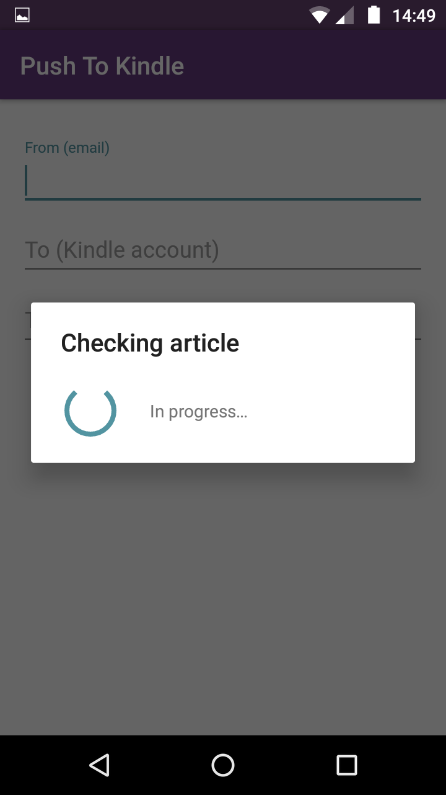
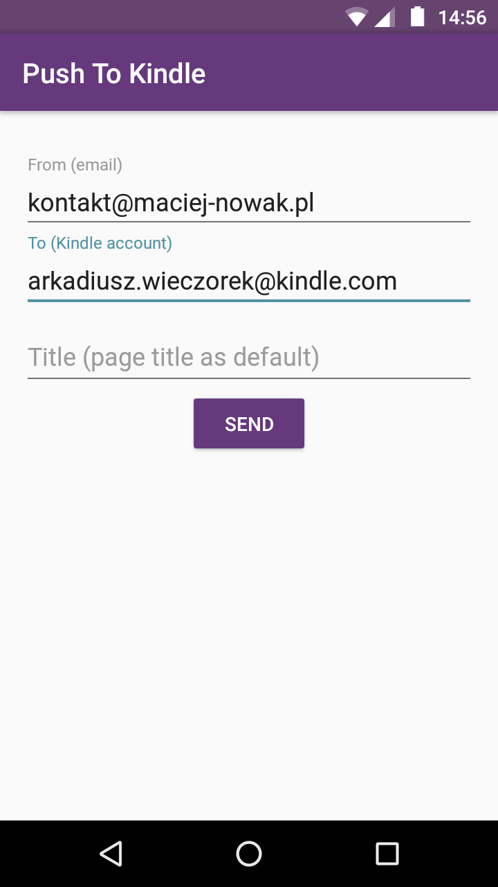

# push-to-kindle
Android app for pushing web articles to Kindle via fivefilters.org.

## App
This app alows to send webpage article in PDF from Android webrowser to Kindla device (using fivefilters.org API). Just share webpage via Push to Kindle from your webrowser, type "from" and "to" fields and voaile!

### Screenshots
App has very simple UI and looks like as screenshots below.

  
